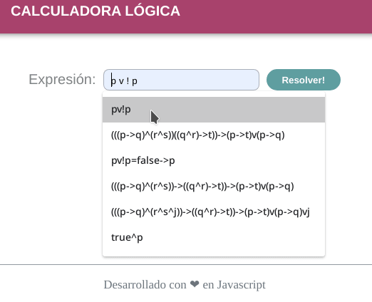
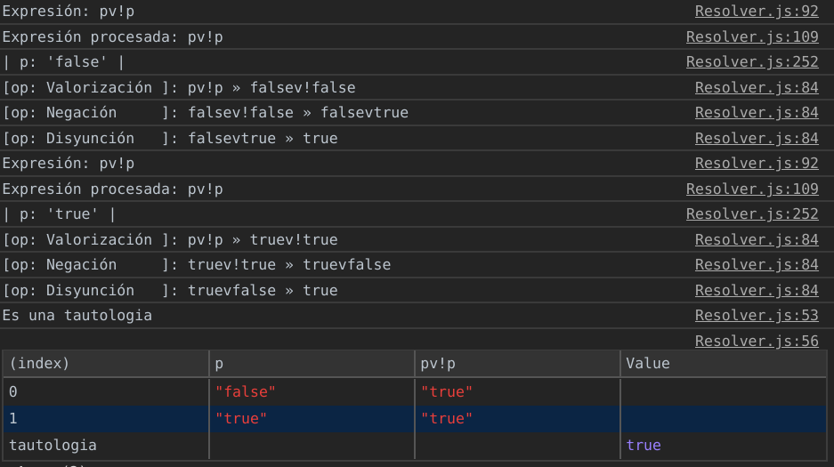

# table of true

This is a simple site for generate tables of true from logical expressions.

For Example: pv!p   (p or not p)

Demo → [https://macu-dev.000webhostapp.com/table_of_true/](https://macu-dev.000webhostapp.com/table_of_true/)

